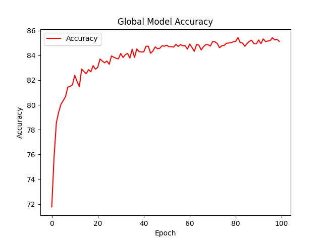
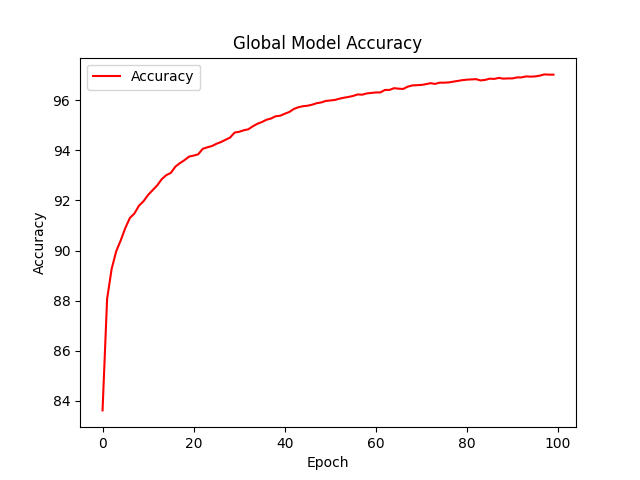
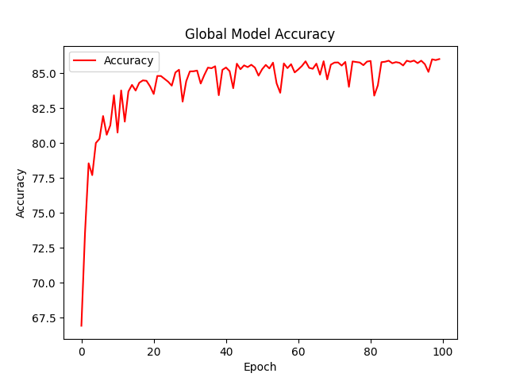
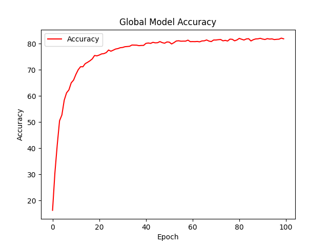

### Edge Federated Learning
This project is based on the traditional federated learning code from chapter03_Python_image_classification in the gitee project **https://gitee.com/helenclaudia/Practicing-Federated-Learning/tree/main**.
This code are run on the M1 pro chip with mps.
#### Python version
- python 3.10

#### Setting
- 100 clients
- 10 edge servers

#### Accuracy
- Resnet18
- cifar10

- 2NN
- mnist

- CNN
- emnist

- CNN
- fashion_mnist

- CNN
- femnist

